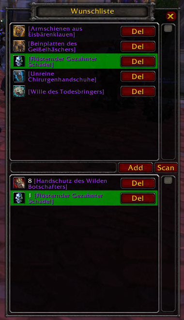

# LootAlert
A simple wishlist WoW® 3.3.5a addon 

## What is it good for
This addon is a small list of items you may want to roll for when in a raid, e.g. ICC or Ruby. It's purpose is to hold track of what you want for your level 80 char.

The lower list shows the already looted items, so you can keep of track of items to be rolled for later.

Future versions may show an alert, if a wished item was looted.

Items are added by entering the item name or part of the item name into the input field in the left right corner, e.g. "Gruftm". You can use the item name in your WoW® language. It is recommendend, to click the "Scan" once, WoW® was started. This loads all epic+ items starting with id 40000 in an array. That allows to search for items, which have not yet seen by the char.

If an item was not found, the entered item name is written into the textbox with a leading "nf " text.

This little addon is still under devlopement, therefore, there is no zip file for download. But if it is cloned into `/Interface/Addons` directory, it can be used.

If the addon was closed, simply enter "/lola" in the chat to reopen the addon window.

The addon was developed while playing on [Rising Gods](https://www.rising-gods.de/).

## Installing
Download LootAlert.zip. Change in `Interface/AddOns` directory and unip the files by keeping the file and directory structure. A new directory `LootAlert` is created with four new files in. 

Use on your own risk.

